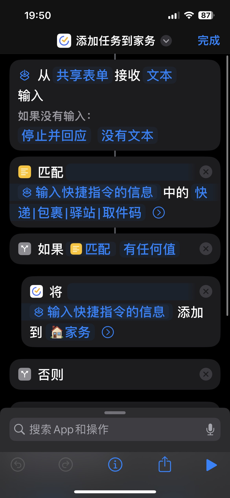
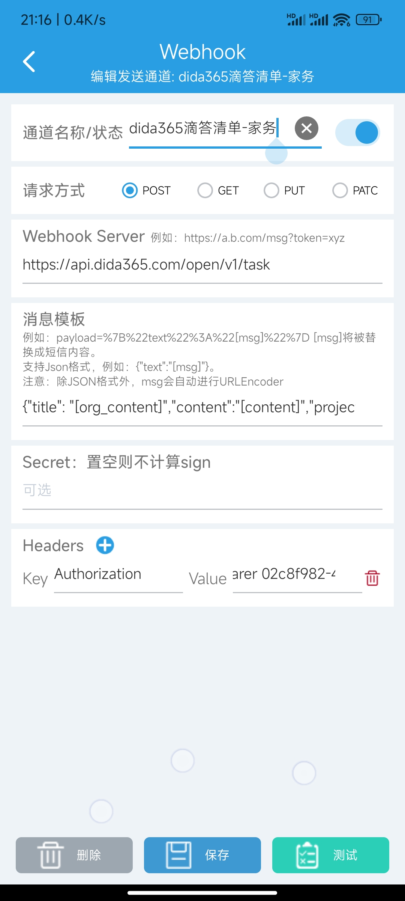

# TOC

# iOS(iPhone/iPad)

The steps are as follows:

## Creating a "Shortcut"

You can modify it based on [the shortcut command I shared](https://www.icloud.com/shortcuts/bfadc821175a4a93b3b9dddd836ea30b):



You can also add it manually by following the steps below:

### Add Action

1. Open the "Shortcuts" app and tap the "+" in the upper right corner.
1. Click "Add Action".
1. Find "Match Text" in the pop-up window (under the "Documents" category, in yellow)
1. Rename this shortcut to &quot;Add task to xxx list&quot;

### Add a Parameter

1.  Click on the exclamation point at the bottom
2.  Enable "Show in Share Sheet"
3.  Click "Done"

### Modify the parameter type

1.  An additional card will appear, click on "Images and 18 more".
2.  Click on "Clear" in the upper left corner (to quickly diable all options)
3.  Find "Text" in the options below and turn it on.
4.  Click "DOne".

### Set Boundary Conditions

"If there's no input":

"Stop and Respond": "No content"

### Set up the content matching rule

Change `Match [0-9a-zA-Z] in "text"` to `Match "快递|包裹|驿站|取件码" in "Shortcut Input"`.

Where "Shortcut Input" is a magic variable, the following text is a regular expression pattern, "|" means "or". I tried "\\d-\\d-\\d{4}" and it didn't work. I don't know why.

### Determine the match result

`If "Matchs" "has any value"`，`Add "Shortcut Input" to the "XX List"`

## Create new &quot;Automation&quot;

Automation: Run Immediately

When `I get a message containing "【"`

Do `Add task to xxx List`(the shortcut you just created)


# Andriod

## Install [SmsForwarder](https://github.com/pppscn/SmsForwarder)

The installation process will not be repeated.

## Add a sending channel

1. Open the SmsForwarder App.
2. Switch to "Sending Channel" in the bottom navigation bar.
3. Click on the "+" in the upper right corner.
4. Choose the type of the sending channel you want. Taking TickTick as an example, select Webhook (URL Scheme should also work, but I haven't tried it on an Android device because I don't have TickTick installed).
5. Fill in the information as below:



The resources involved in Fig:

1. [TickTick create-task API](https://developer.dida365.com/api#/openapi?id=create-task)
2. [Steps to get a TickTick Access Token](https://developer.dida365.com/api#/openapi?id=get-access-token) and [Simple codes](https://gist.github.com/bowencool/7da8630dafe9d07e7e004def2dcb851b)：

```js
const Koa = require("koa");

const Router = require("@koa/router");

const { PORT = 4001 } = process.env;
const client_id = "xxx";
const client_secret = "xxx";
const scope = "tasks:write";
const redirect_uri = `http://localhost:${PORT}/redirect`;

const app = new Koa();
const router = new Router();

router.get("/", async (ctx, next) => {
  await next();

  ctx.body = `<a href="https://dida365.com/oauth/authorize?scope=tasks:write&client_id=${client_id}&state=state&redirect_uri=${encodeURIComponent(
    redirect_uri
  )}&response_type=code">Click to Login</a>`;
  ctx.response.status = 200;
});

router.get("/redirect", async (ctx, next) => {
  await next();
  let code = ctx.query.code;
  let buff = Buffer.from(`${client_id}:${client_secret}`);
  let base64data = buff.toString("base64");
  const response = await fetch("https://dida365.com/oauth/token", {
    method: "POST",
    headers: {
      Authorization: `Basic ${base64data}`,
      "Content-Type": `application/x-www-form-urlencoded`,
    },
    body: Object.entries({
      code,
      grant_type: "authorization_code",
      scope,
      redirect_uri,
    })
      .map(([key, value]) => {
        return encodeURIComponent(key) + "=" + encodeURIComponent(value);
      })
      .join("&"),
  });
  const data = await response.text();
  ctx.body = data;
  ctx.response.status = response.status;
});

app.use(router.routes()).use(router.allowedMethods()).listen(PORT);
console.log(`listened http://localhost:${PORT}`);
```

## Add a forwarding rules

1. Open the App
2. Switch to "forwarding rules" in the bottom navigation bar.
3. Switch to "sms messages" in the top navigation bar.
4. Click on the "+" in the upper right corner.
5. Fill in the information as below:


Please check the official documentation for other configuration items.

If you find this article helpful, please give it a like or support it with a [Star](https://github.com/bowencool/blog) below.
