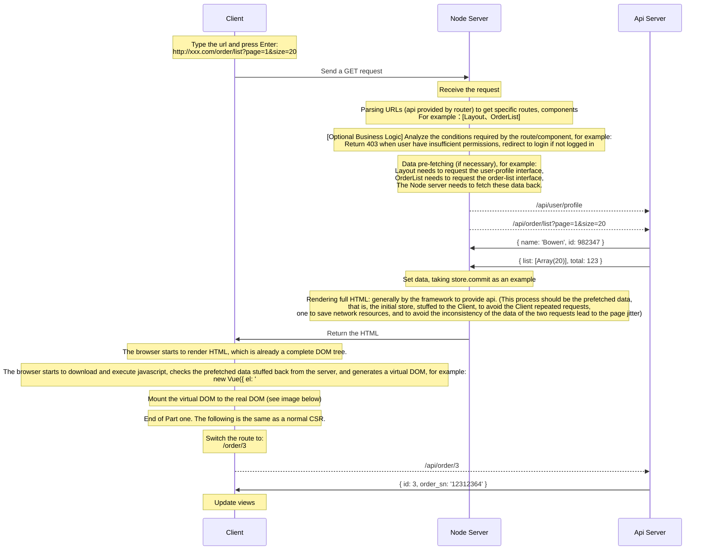
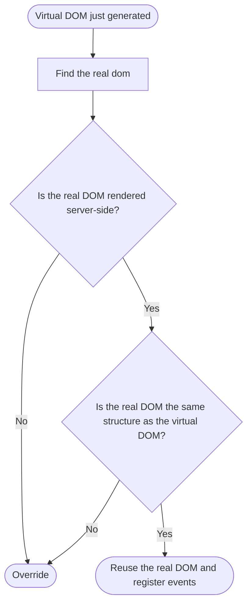

## What is SSR

Server Side Rendering (SSR) refers to the process of rendering web pages on the server side. The main difference from traditional client-side rendering (CSR) is that in CSR mode, the server returns:

```html
<body>
  <div id="app"></div>
  <script src="/main.xxx.js"></script>
</body>
```

In SSR mode, the server returns

```html
<div id="app" data-server-rendered="true">
  <div class="user-wraper">
    <p>Hello, Bowen!</p>
  </div>
  <ul class="order-list">
    <li>Order ID：111</li>
    <li>Order ID：222</li>
    ...
  </ul>
</div>
```

## Why Use SSR

The main advantages are:

- Reducing white screen time
- SEO friendly

## SSR Sequence Diagram

<!--  -->



### Mount the virtual DOM to the real DOM

<!--  -->


