看过了太多开发者设计的 OAuth 流程，有很多人竟然需要前端参与开发，渲染前端页面本身就是很复杂的流程了，竟然还要反复渲染页面，性能极差、可读性极差、又浪费人力，我实在是看不下去了。

OAuth 这个流程完全只需要依赖 HTTP 状态流转就行了，完全不需要前端页面处理，而且性能极好，实测 200ms 内就能完成认证过程。前端参与的那种方案，每次都渲染页面都至少一秒多了，加起来至少也得五秒了，这还是页面性能及格的情况下。。。整个世界就是一个大草台班子！

## 流程

```mermaid
sequenceDiagram
Note over Client: 输入 URL 或点击 a 标签: <br>xxx.com/api/oauth/login?platform=github
Client -->> Server(xxx.com/api): GET xxx.com/api/oauth/login?platform=github
Note over Server(xxx.com/api): 根据参数拼凑认证 URL 并重定向到这个URL

Server(xxx.com/api)->>Client: 响应并重定向<br>302 Location: github.com/login/oauth/authorize?client_id=abc&..
Client-->>Platform(Google/GitHub/...): 被重定向到<br>GET github.com/login/oauth/authorize?client_id=abc&..

Note over Platform(Google/GitHub/...): 第一次授权需要用户点击按钮，后面不需要
Platform(Google/GitHub/...)->>Client: 再次重定向<br>302 Location: xxx.com/api/oauth/redirect?code=123&...

Client -->> Server(xxx.com/api): 被重定向到<br>GET xxx.com/api/oauth/redirect?code=123&...

Server(xxx.com/api)-->>Platform(Google/GitHub/...): 使用 code 换取 access_token<br>POST github.com/login/oauth/access_token?code=123&...
Platform(Google/GitHub/...)->>Server(xxx.com/api): {access_token:"xyz"}

Server(xxx.com/api)-->>Platform(Google/GitHub/...): 使用 access_token 获得用户资料<br>POST api.github.com/user?access_token=xyz
Platform(Google/GitHub/...)->>Server(xxx.com/api): {name:"bowen",mail:"..."}
Note over Server(xxx.com/api): 更新或创建用户
Note over Server(xxx.com/api): 签名（生成 token）

Server(xxx.com/api)->>Client: 响应 HTTP，并 set-cookie，<br>并且重定向到用户最初访问的页面<br>302 Location: xxx.com/dashboard
Note over Client: 被重定向到 xxx.com/dashboard，用户看到登录后的页面
```



## 代码实现

```ts
import { Controller, Get, Query, Response } from "@nestjs/common";
import { Response as RawResponse } from "express";

@Controller("oauth")
export class OAuthController {
  constructor(private readonly authService: AuthService) {}

  @Get("login")
  async redirectToLogin(@Response() res: RawResponse, @Query("back") back = "/", @Query("platform") platform: string) {
    console.log(`👨🏻‍💻 login by ${platform}`);
    let state = back;
    let loginUrl: string;
    const redirect_uri = `${process.env.SELF_URL}/api/oauth/redirect?platform=${platform}`;
    switch (platform) {
      case OAuthPlatform.Google:
        loginUrl = `https://accounts.google.com/o/oauth2/v2/auth?client_id=${
          process.env.GOOGLE_CLIENT_ID
        }&redirect_uri=${encodeURIComponent(
          redirect_uri
        )}&response_type=code&scope=https://www.googleapis.com/auth/userinfo.email+https://www.googleapis.com/auth/userinfo.profile&state=${state}`;
        break;
      case OAuthPlatform.GitHub:
        loginUrl = `https://github.com/login/oauth/authorize?client_id=${
          process.env.GITHUB_CLIENT_ID
        }&redirect_uri=${encodeURIComponent(redirect_uri)}&state=${state}&scope=read:user,user:email`;
        break;
      case OAuthPlatform.GitLab:
        loginUrl = `${gitlabConstants.instanceUrl}/oauth/authorize?client_id=${
          gitlabConstants.oauth.client_id
        }&redirect_uri=${encodeURIComponent(
          redirect_uri
        )}&response_type=code&state=${state}&scope=read_user+email&code_challenge=${
          challenge.code_challenge
        }&code_challenge_method=S256`;
        break;
      // case 'wechat':
      //   loginUrl = `https://open.weixin.qq.com/connect/qrconnect?appid=${
      //     process.env.WECHAT_APPID
      //   }&redirect_uri=${encodeURIComponent(
      //     redirect_uri,
      //   )}&response_type=code&scope=snsapi_userinfo&state=${state}#wechat_redirect`;
      //   break;
      default:
        res.status(400).send("unknown platform:" + platform);
        return;
    }
    if (loginUrl) {
      console.log("redirect to:", loginUrl);
      res.redirect(302, loginUrl);
    }
  }

  @Get("redirect")
  async redirect(
    @Query("code") code: string,
    @Query("state") state = "/",
    @Query("platform") platform: OAuthPlatform,
    @Query("error_description") error_description: string,
    @Response() res: RawResponse
  ) {
    if (error_description) {
      res.status(400).send(error_description);
      return;
    }

    let backUrl = decodeURIComponent(state);

    let user: ReqUserDTO;
    if (code) {
      console.log(`👨🏻‍💻 ${platform} oauth`);
      let redirect_uri = `${process.env.SELF_URL}/api/oauth/redirect?platform=${platform}`;
      switch (platform) {
        case OAuthPlatform.Google:
          try {
            const rez = await request<{
              access_token: string;
            }>("https://oauth2.googleapis.com/token", {
              // https://developers.google.com/identity/protocols/oauth2/web-server#httprest_1
              method: "POST",
              query: {
                client_id: process.env.GOOGLE_CLIENT_ID,
                client_secret: process.env.GOOGLE_CLIENT_SECRET,
                redirect_uri,
                code,
                grant_type: "authorization_code",
              },
            });
            console.log("got google access_token", rez);
            const googleUser = await request<{
              email: string;
              name: string;
              picture: string;
              verified_email: boolean;
            }>("https://www.googleapis.com/oauth2/v1/userinfo", {
              headers: { Authorization: `Bearer ${rez.access_token}` },
            });
            console.log("got google user", googleUser);
            if (!googleUser.verified_email) {
              res.status(400).send("email not verified");
              return;
            }
            user = await this.authService.upsertUser(
              {
                avatar: googleUser.picture,
                name: googleUser.name,
                email: googleUser.email,
              },
              {
                platform,
                // exUserId: googleUser.email,
                exUserName: googleUser.name,
                exUserIdStr: googleUser.email,
                accessToken: rez.access_token,
              },
              inviteCode
            );
          } catch (error) {
            res.status(500).send(error2String(error));
            console.error(error);
            return;
          }
          break;
        case OAuthPlatform.GitHub:
          try {
            const rez = await request<{
              access_token: string;
              scope: string;
              token_type: string;
            }>("https://github.com/login/oauth/access_token", {
              // https://docs.github.com/en/apps/oauth-apps/building-oauth-apps/authorizing-oauth-apps
              method: "POST",
              query: {
                client_id: process.env.GITHUB_CLIENT_ID,
                client_secret: process.env.GITHUB_CLIENT_SECRET,
                redirect_uri,
                code,
              },
              headers: {
                Accept: "application/json",
              },
            });
            console.log("got github access_token");
            const githubUser = await request<GitHubUser>("https://api.github.com/user", {
              headers: { Authorization: `Bearer ${rez.access_token}` },
            });
            // console.log(githubUser);
            if (!githubUser.email) {
              console.log("no public email, try to get verified email");
              const emails = await request<{ verified: boolean; email: string; primary: true }[]>(
                "https://api.github.com/user/emails",
                {
                  headers: { Authorization: `Bearer ${rez.access_token}` },
                }
              );
              // console.log(emails);
              const primaryEmail = emails.find(email => email.primary);
              if (primaryEmail) {
                githubUser.email = primaryEmail.email;
              } else {
                githubUser.email = emails.find(email => email.verified)?.email;
              }
            }
            user = await this.authService.upsertUser(
              {
                avatar: githubUser.avatar_url,
                name: githubUser.name,
                email: githubUser.email,
              },
              {
                platform,
                exUserId: githubUser.id,
                exUserName: githubUser.name,
                exUserIdStr: githubUser.login,
                accessToken: rez.access_token,
              },
              inviteCode
            );
          } catch (error) {
            res.status(500).send(error2String(error));
            console.error(error);
            return;
          }
          break;
        case OAuthPlatform.GitLab:
          try {
            const rez = await request<{
              access_token: string;
              refresh_token: string;
              token_type: string;
              created_at: number;
            }>(gitlabConstants.instanceUrl + "/oauth/token", {
              // https://docs.gitlab.com/ee/api/oauth2.html
              method: "POST",
              query: {
                ...gitlabConstants.oauth,
                redirect_uri,
                code,
                grant_type: "authorization_code",
                code_verifier: challenge.code_verifier,
              },
            });
            console.log("got gitlab access_token");
            const gitlabUser = await request<GitLabUser>(gitlabConstants.instanceUrl + "/api/v4/user", {
              headers: { Authorization: `Bearer ${rez.access_token}` },
            });
            user = await this.authService.upsertUser(
              {
                avatar: gitlabUser.avatar_url,
                name: gitlabUser.name,
                email: gitlabUser.email,
              },
              {
                platform,
                exUserId: gitlabUser.id,
                exUserName: gitlabUser.name,
                exUserIdStr: gitlabUser.username,
                accessToken: rez.access_token,
                refreshToken: rez.refresh_token,
              },
              inviteCode
            );
          } catch (error) {
            console.error(error);
          }
          break;
        default:
          res.status(400).send("unknown platform:" + platform);
          return;
      }
    }
    if (user) {
      const access_token = await this.authService.login(user);
      res.cookie(COOKIE_NAME, access_token, {
        httpOnly: true,
        sameSite: "none",
        secure: true,
        maxAge: 1000 * 60 * 60 * 24 * 7,
      });
      if (backUrl.startsWith("/")) {
        backUrl = `${process.env.DASHBOARD_URL}${backUrl}`;
      }
      res.redirect(302, backUrl);
      return;
    }
    res.status(500).send("Something went wrong.");
  }
}
```
