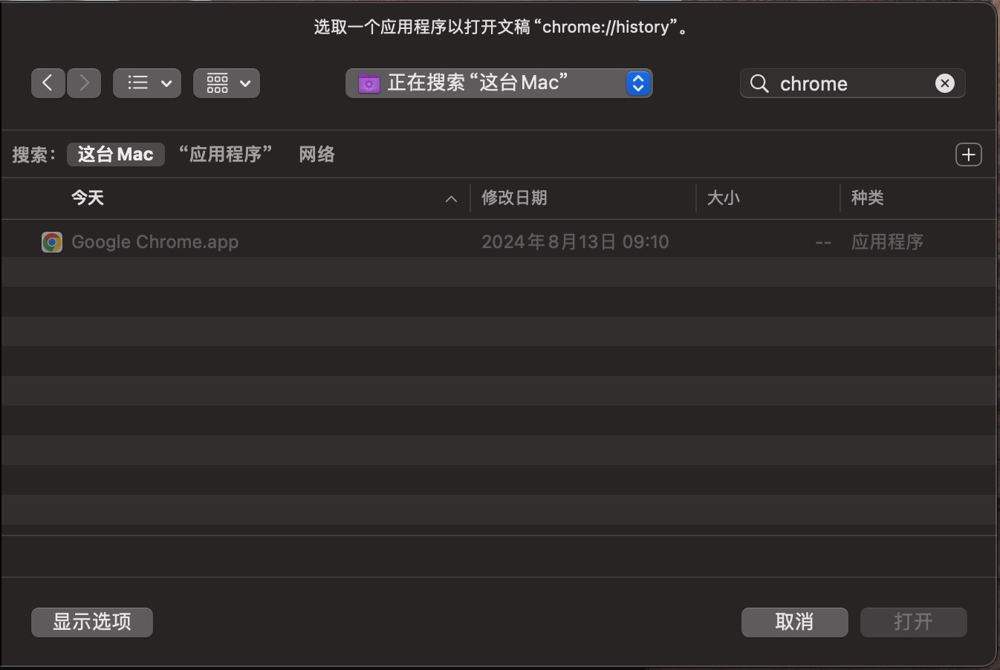
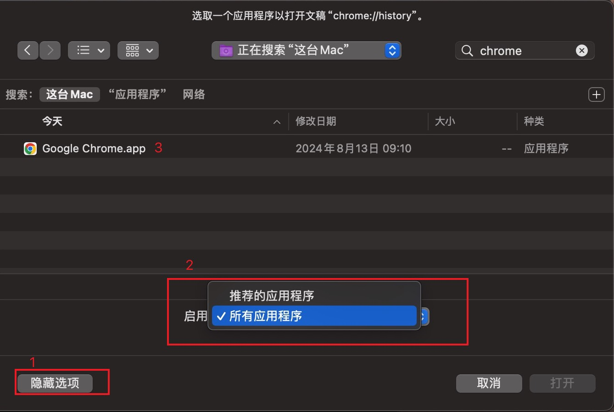
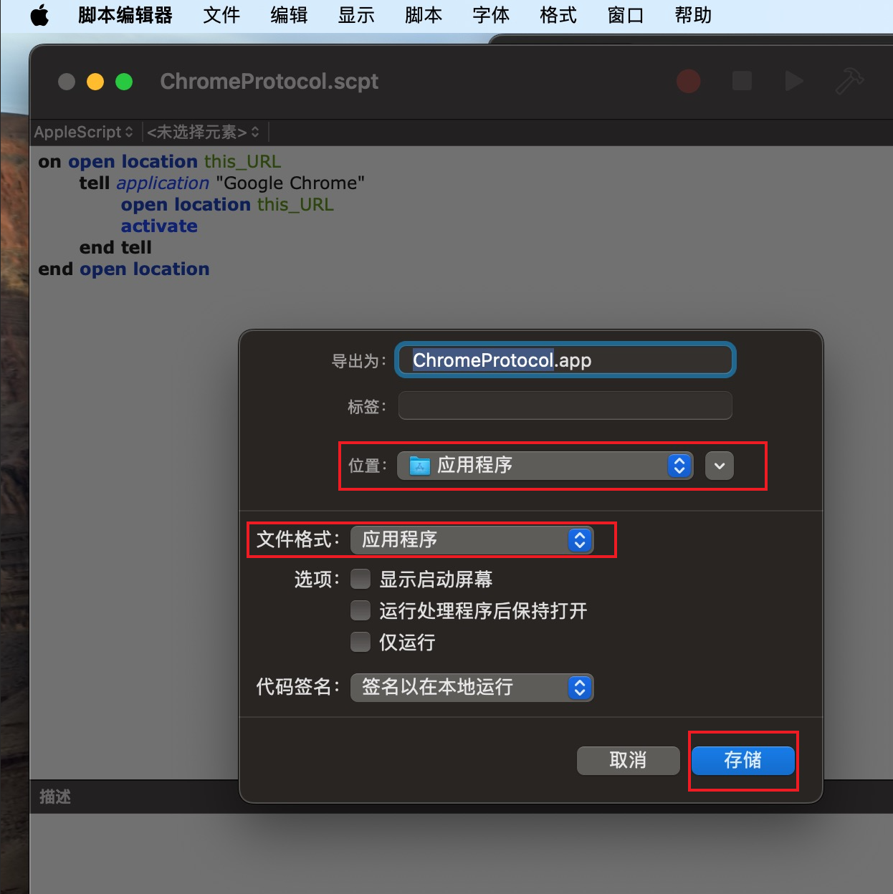
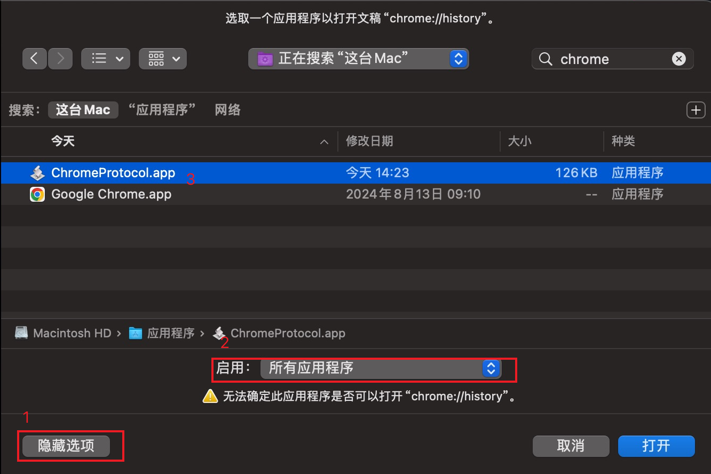

## 解决什么问题？

如果你尝试通过 Alfred 或 Raycast 等其他应用打开类似 "chrome://history" 或 "chrome-extension://xxx" 的 URL，你会得到这个错误：“未设定用来打开 URL chrome://history的应用程序”。


而当你点击“选取应用程序...”按钮时，你会发现“Google Chrome”无法被选中：



## 临时解决方案

单击左下角的“显示选项”按钮，然后选择“所有应用程序”而不是“推荐的应用程序”。



你将看到 Chrome 已打开其历史记录页面。但你每次都必须执行这些步骤，这很不方便。

## 一劳永逸的解决方案

首先，我们应该将“chrome://”和“chrome-extension://”这两个 URL Schema 链接到 Chrome。这可以通过修改`/Applications/Google Chrome.app/Contents/Info.plist`来完成（现在不要修改）：

```diff
	<key>CFBundleURLTypes</key>
	<array>
		<dict>
			<key>CFBundleURLName</key>
			<string>Web site URL</string>
			<key>CFBundleURLSchemes</key>
			<array>
				<string>http</string>
				<string>https</string>
+				<string>chrome</string>
+				<string>chrome-extension</string>
			</array>
		</dict>
		<dict>
			<key>CFBundleURLName</key>
			<string>Local file URL</string>
			<key>CFBundleURLSchemes</key>
			<array>
				<string>file</string>
			</array>
		</dict>
	</array>
```

然而，这会破坏Chrome，并且在更新时对用户不友好。因此，我们可以创建一个新应用来链接这两个URL Schema：

打开 `/Applications/Utilities/Script Editor.app` 并将以下代码粘贴到其中：

```applescript
on open location this_URL
	tell application "Google Chrome"
		open location this_URL
		activate
	end tell
end open location
```

点击“文件”并选择“导出”。将文件格式设置为“应用程序”，命名应用（例如，ChromeProtocol.app），然后保存。



打开 `/Applications/ChromeProtocol.app/Contents/Info.plist` 并添加以下配置：

```xml
	<key>CFBundleURLTypes</key>
	<array>
		<dict>
			<key>CFBundleURLName</key>
			<string>Chrome Internal URL</string>
			<key>CFBundleURLSchemes</key>
			<array>
				<string>chrome</string>
				<string>chrome-extension</string>
			</array>
		</dict>
	</array>
```

保存并退出编辑器。

然后通过其他应用（例如 Raycast）打开“chrome://history”。选择我们刚刚创建的新应用“Chrome Protocol.app”以打开此 URL，就像我们上面所做的那样：



你会发现一切都完美运行了。🎉🎉🎉
