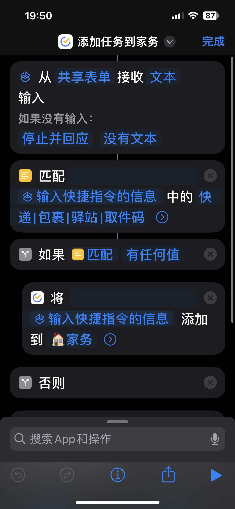
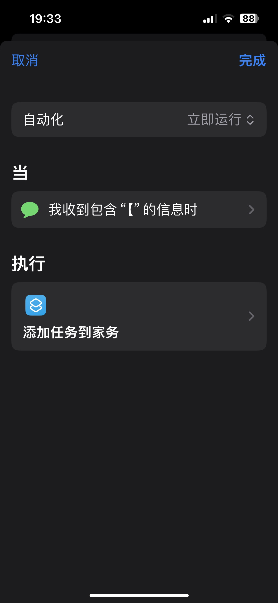
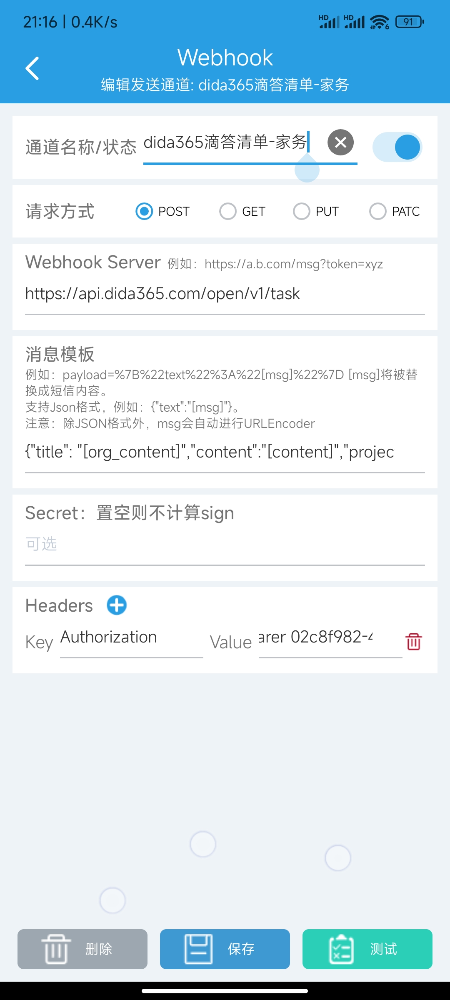
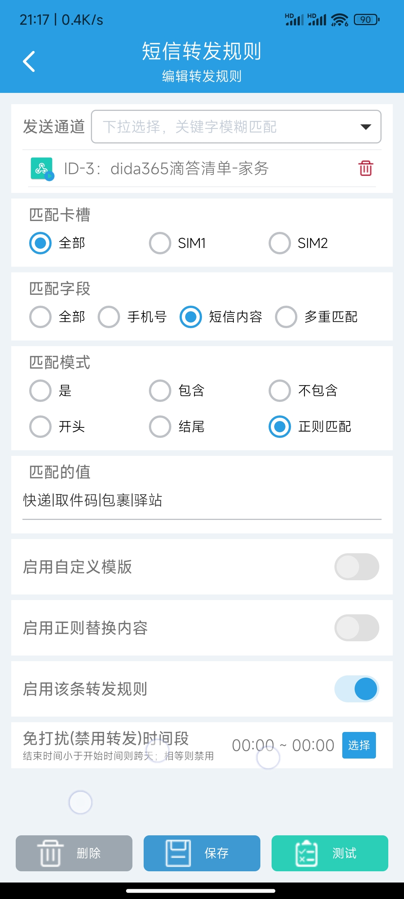

# 目录

# iOS(iPhone/iPad)

步骤如下：

## 新建“快捷指令”

你可在[我分享的快捷指令](https://www.icloud.com/shortcuts/bfadc821175a4a93b3b9dddd836ea30b)基础上修改：



也可以按照下面的步骤手动添加：

### 添加操作

1. 打开“快捷指令”APP，并点击右上角“+”
1. 点击“添加操作”
1. 在弹窗中找到“匹配文本”（文本类别下，黄色的）
1. 重命名此快捷指令为“添加任务到XX清单”

### 添加参数

1.  点击底部的感叹号
2.  打开“在共享表单中显示”
3.  点击“完成”。

### 修改参数类型

1.  此时会多出一个卡片，点击“图像和其他18个”
2.  点击左上角“清除”（快速关闭所有选项）
3.  在下面的选项里找到“文本”并打开
4.  点击完成

### 设置边界条件

“如果没有输入”：

“停止并回应”: “无内容”

### 设置内容匹配规则

把 `匹配“文本”中的[0-9a-zA-Z]` 改成 `匹配“输入快捷指令的信息”中的“快递|包裹|驿站|取件码”`。

其中“输入快捷指令的信息”为魔法变量，后面的字符串是正则表达式 pattern，“|”（英文）表示“或”。我试过"\\d-\\d-\\d{4}"没生效，不知道为啥。

### 判断匹配结果

`如果“匹配”有任何值`，`将“输入快捷指令的信息”添加到“清单”`

## 新建“自动化”

自动化：立即运行

当`我收到包含“”的信息时`

执行`添加任务到XX清单`（刚才新建的快捷指令）



# 安卓手机

## 安装 [短信转发器](https://github.com/pppscn/SmsForwarder)

安装过程不再赘述。

## 添加发送通道

1. 打开 APP。
2. 切换到底部导航栏的“发送通道”。
3. 点击右上角“+”
4. 选择你想要转发的类型，以滴答清单为例，选择 Webhook（URL Scheme 应该也可以，我没在安卓机上安装滴答清单，所以没尝试）
5. 填入信息如下：



图中涉及到的资源：

1. [滴答清单 创建任务 API](https://developer.dida365.com/api#/openapi?id=create-task)
2. [滴答清单 获取 Access Token 步骤](https://developer.dida365.com/api#/openapi?id=get-access-token) 及 [简易代码](https://gist.github.com/bowencool/7da8630dafe9d07e7e004def2dcb851b)：

```js
const Koa = require("koa");

const Router = require("@koa/router");

const { PORT = 4001 } = process.env;
const client_id = "xxx";
const client_secret = "xxx";
const scope = "tasks:write";
const redirect_uri = `http://localhost:${PORT}/redirect`;

const app = new Koa();
const router = new Router();

router.get("/", async (ctx, next) => {
  await next();

  ctx.body = `<a href="https://dida365.com/oauth/authorize?scope=tasks:write&client_id=${client_id}&state=state&redirect_uri=${encodeURIComponent(
    redirect_uri
  )}&response_type=code">点击登录</a>`;
  ctx.response.status = 200;
});

router.get("/redirect", async (ctx, next) => {
  await next();
  let code = ctx.query.code;
  let buff = Buffer.from(`${client_id}:${client_secret}`);
  let base64data = buff.toString("base64");
  const response = await fetch("https://dida365.com/oauth/token", {
    method: "POST",
    headers: {
      Authorization: `Basic ${base64data}`,
      "Content-Type": `application/x-www-form-urlencoded`,
    },
    body: Object.entries({
      code,
      grant_type: "authorization_code",
      scope,
      redirect_uri,
    })
      .map(([key, value]) => {
        return encodeURIComponent(key) + "=" + encodeURIComponent(value);
      })
      .join("&"),
  });
  const data = await response.text();
  ctx.body = data;
  ctx.response.status = response.status;
});

app.use(router.routes()).use(router.allowedMethods()).listen(PORT);
console.log(`listened http://localhost:${PORT}`);
```

## 添加转发规则

1. 打开 APP。
2. 切换到底部导航栏的“转发规则”
3. 切换到顶部导航栏的“短信”。
4. 点击右上角“+”
5. 填入信息如下：



其他配置项请查看官方文档。

如果您觉得本文对您有帮助，请在下方点赞或给予 [Star](https://github.com/bowencool/blog) 支持。
